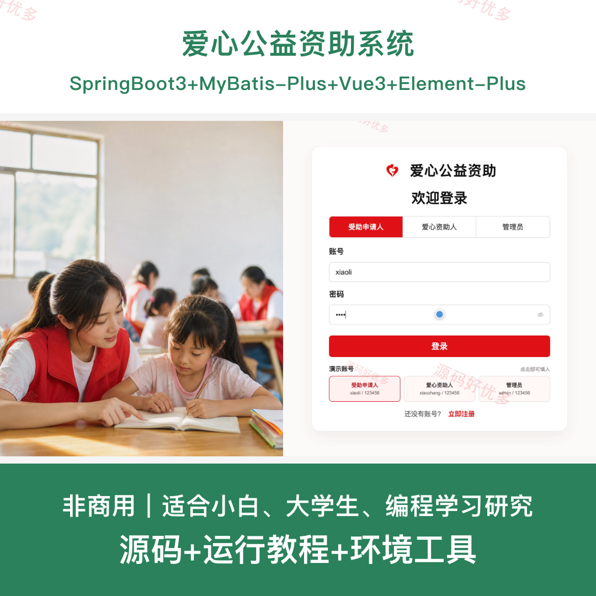
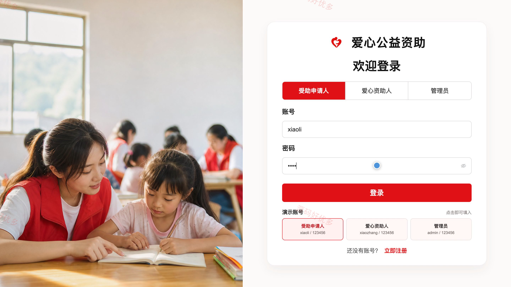
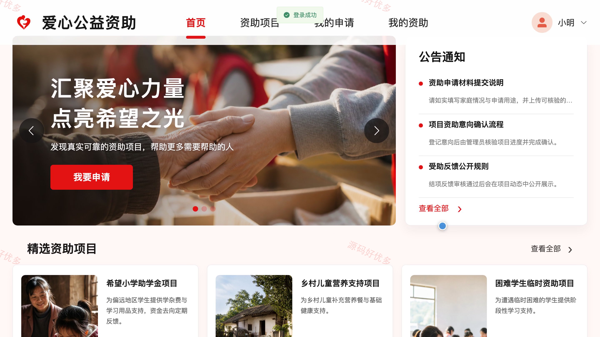
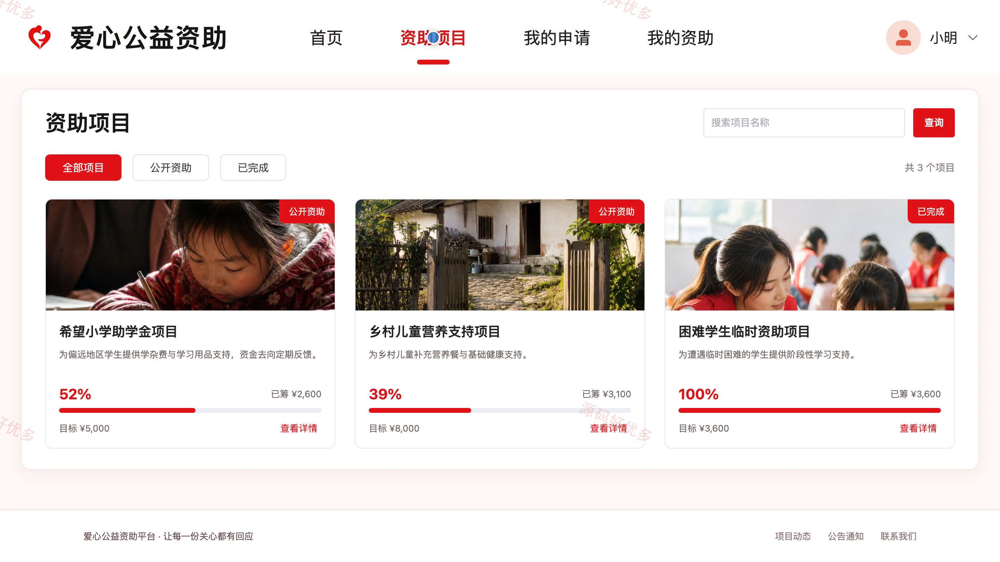
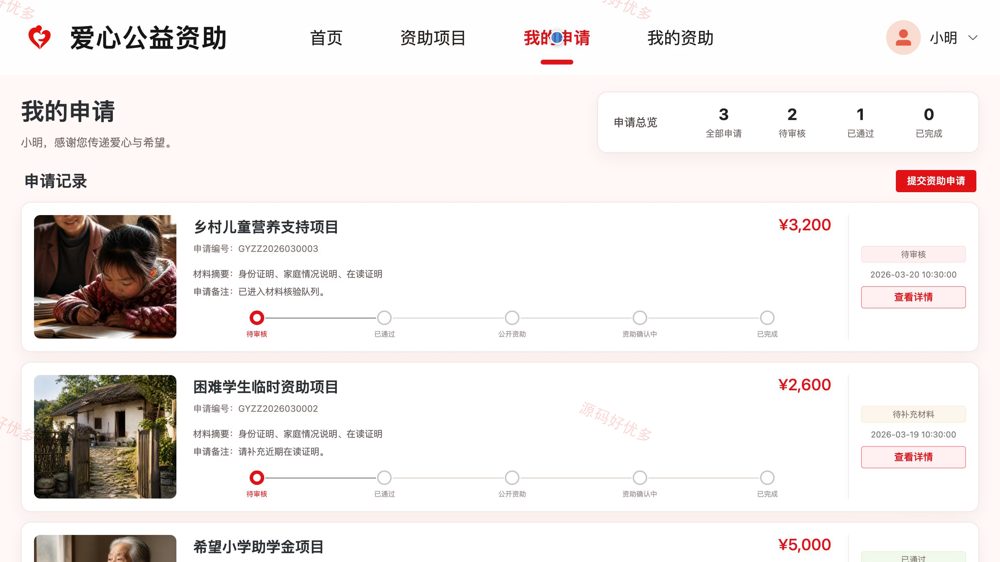
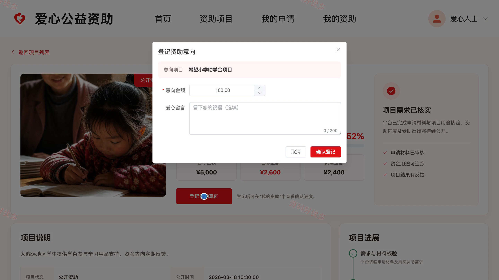
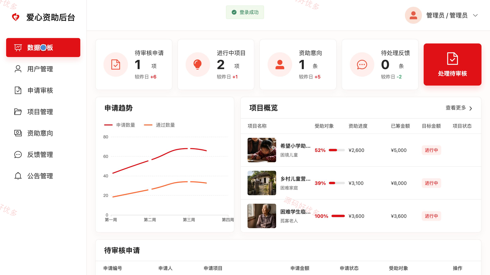
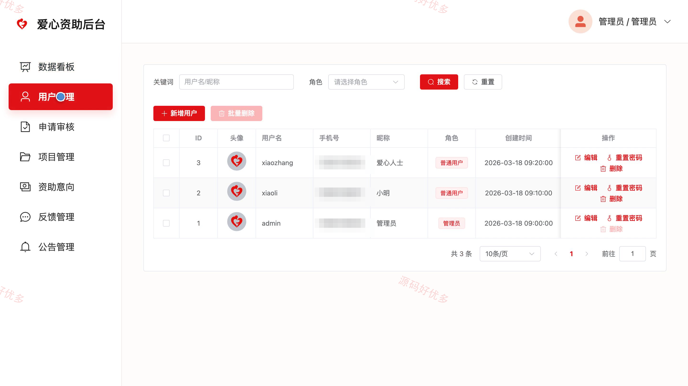
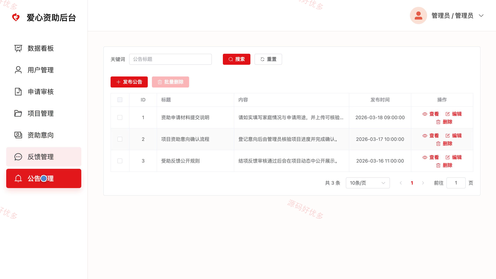

# bs030A
bs030A爱心公益资助系统
## 源码问题查看主页咨询

### 一、关键词
公益资助、爱心助学、困难救助、公益项目、资助申请

### 二、作品包含
源码+数据库+全套环境和工具资源+本地部署教程

### 三、项目技术
前端技术： Html、Css、Js、Vue3.4、Element-Plus
后端技术：Java、SpringBoot3.2.0、MyBatis-Plus

### 四、运行环境（以下版本亲测，其他版本兼容性请自行测试）
开发工具：IDEA/eclipse + VSCODE

数据库：MySQL5.7+（共1张表）

数据库管理工具：Navicat10以上版本

环境配置软件： JDK17 + Maven3.6.3

前端Nodejs：16+

浏览器：谷歌浏览器

### 五、项目介绍
项目编号：bs030A

爱心公益资助系统面向受助申请人、爱心资助人和管理员，覆盖资助申请、材料审核、项目公开、资助意向确认与受助反馈，形成从需求提交到项目进度公开的公益协作闭环。

角色：受助申请人、爱心资助人、管理员

受助申请人功能：账号注册与登录、资助申请提交、证明材料上传与查看、申请进度与详情查询、受助反馈提交与查看、公告通知查看、个人资料与密码维护。

爱心资助人功能：账号登录、公益项目浏览、项目详情与进度查看、资助意向登记、个人资助记录查询、受助反馈与公告查看、个人资料与密码维护。

管理员功能：数据看板统计、用户管理、受助申请与材料审核、公益项目管理、资助意向确认、受助反馈审核、公告管理、个人资料维护。

### 六、运行截图

